# Top 28 Best Podcast Hosting Platforms in 2025

Ever feel like launching a podcast is more complicated than it should be? You record a great episode, then spend hours figuring out how to get it on Apple Podcasts, Spotify, and everywhere else people actually listen. The right podcast hosting platform handles distribution automatically, gives you real analytics about who's tuning in, and doesn't charge you an arm and a leg for storage. Whether you're testing the waters with your first show or managing a full network, these platforms make the technical stuff disappear so you can focus on creating content people want to hear.

## [Buzzsprout](https://www.buzzsprout.com)

A beginner-friendly podcast hosting platform that handles everything from RSS feed creation to directory submission, perfect for hobbyists and serious creators alike.

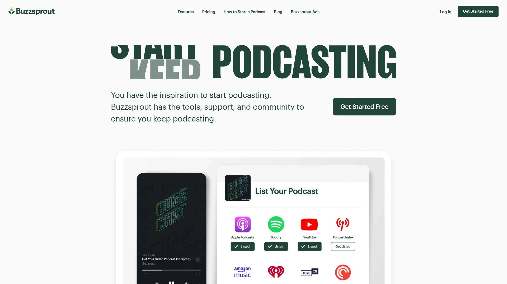

What makes Buzzsprout click for so many podcasters is how it removes friction from the entire process. Upload your audio file, add show notes, and the platform automatically submits your episode to Apple Podcasts, Spotify, Google Podcasts, and other major directories. You get advanced analytics that show listener locations, device types, and which episodes perform best, helping you understand your audience without drowning in data.

The platform includes Magic Mastering, an add-on that automatically adjusts your audio to match Apple Podcasts' loudness standards, saving you from manual editing. Cohost AI generates episode titles, descriptions, and chapter markers using artificial intelligence, cutting down on the administrative work that eats into your production time. A free hosted website comes with paid plans, giving your podcast a home on the web without needing to build one from scratch.

**Pricing Structure:**
Free plan offers 2 hours monthly upload with 90-day episode storage, suitable for testing whether podcasting fits your schedule. Paid plans start at $12/month for 3 hours, $18/month for 6 hours, and $24/month for 12 hours, with unlimited storage and no time limits on episode availability. Additional hours cost $2-4 depending on your plan tier. The platform supports listener subscriptions where fans pay for premium content, with a 15% flat fee on transactions.

## [Spotify for Creators](https://podcasters.spotify.com)

Formerly known as Anchor, this completely free platform gives you unlimited hosting and direct access to Spotify's massive listener base.

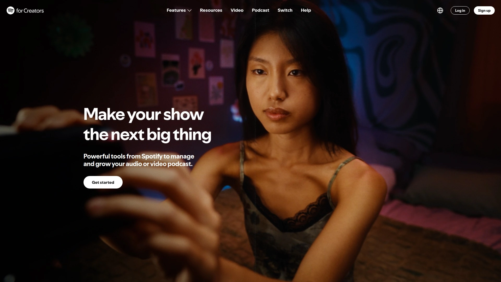

Spotify for Creators removes all financial barriers to podcasting by offering unlimited audio and video hosting at zero cost. The interface is deliberately simple, making it possible to record, edit, and publish episodes from your phone or desktop without technical knowledge. Distribution happens automatically to major directories, though the platform is optimized primarily for Spotify's ecosystem.

Analytics have improved significantly from the old Anchor days, now providing detailed data on episode performance, listener demographics, and behavior patterns specific to Spotify users. Monetization options include subscriptions, one-off listener donations, and programmatic ads through the Spotify Audience Network, though the ad revenue split is notably steep at 50%. Interactive features like polls, Q&As, and clickable timestamps in show notes help build audience engagement.

The main trade-off is reduced control compared to traditional hosts, as you're building your show within Spotify's ecosystem and subject to their terms and future changes. Customer support relies heavily on help articles and community forums rather than direct human assistance.

## [Podbean](https://www.podbean.com)

A comprehensive podcast solution offering both free and paid tiers with built-in monetization tools that let creators earn without chasing sponsors.

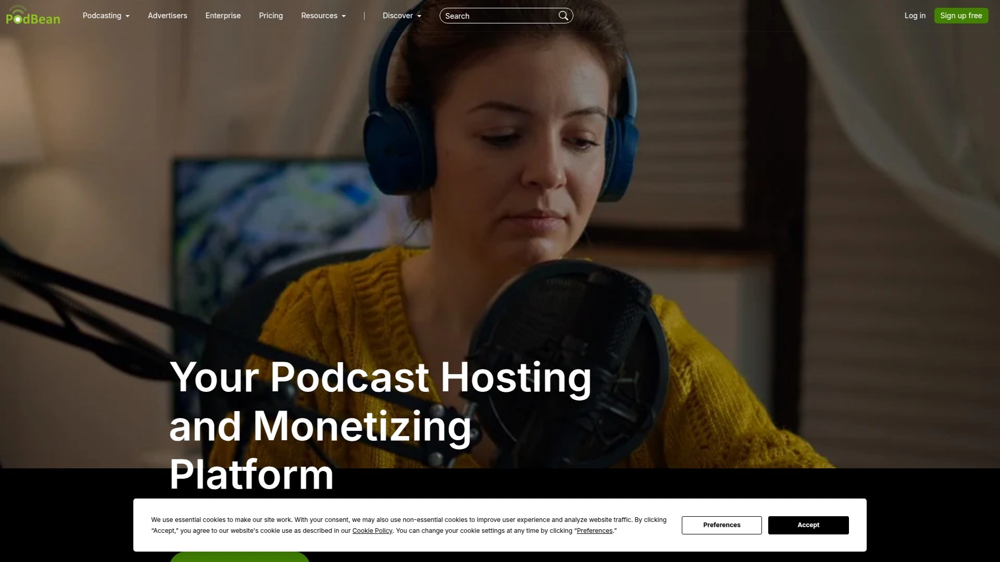

Podbean stands out by integrating recording, editing, and hosting into a single dashboard, eliminating the need to bounce between multiple tools. Over 600,000 creators use the platform, which distributes shows to Apple Podcasts and Spotify while managing Apple Podcasts Subscriptions for paid content. Live streaming capabilities let you record episodes while chatting with your audience in real-time, adding an interactive dimension to your show.

The free plan includes 5 hours of storage and 100GB monthly bandwidth, plus a basic website and podcast analytics. At $9/month, you unlock unlimited storage and bandwidth, advanced design options, and access to the Podbean Ads Marketplace for dynamic ad insertion. A native patron page allows listeners to send tips directly, creating a revenue stream independent of traditional advertising.

## [Libsyn](https://libsyn.com)

One of the oldest podcast hosting services, trusted by major shows for its reliability, granular analytics, and complete control over distribution.

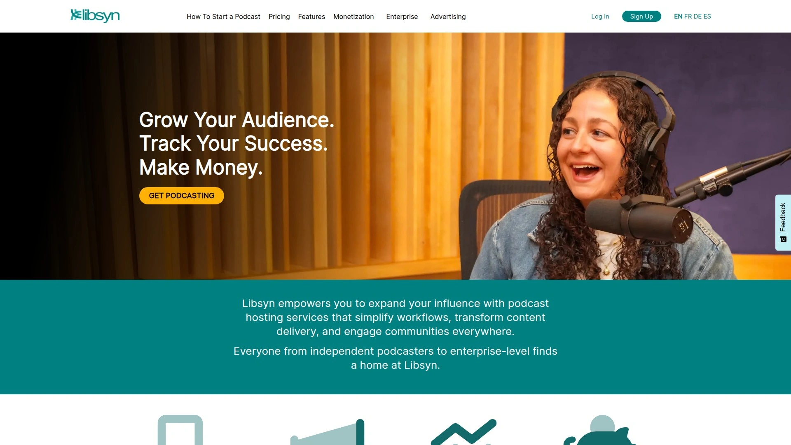

As a pioneer in podcast hosting since the mid-2000s, Libsyn has built a reputation for rock-solid infrastructure that handles large volumes of data without hiccups. The platform gives podcasters full control over content and distribution rather than locking them into a proprietary ecosystem. Advanced analytics are certified by the Interactive Advertising Bureau, providing advertiser-friendly data that helps secure sponsorships.

Monetization options include premium content subscriptions, listener donations, and advertising integrations. The Publisher Hub plugin integrates with WordPress for seamless episode publishing. Plans start at $5/month for 50MB monthly storage, scaling up to accommodate shows with higher upload needs.

## [Transistor](https://transistor.fm)

An unlimited podcast hosting platform designed for creators, teams, and brands who want to scale without worrying about storage or episode limits.

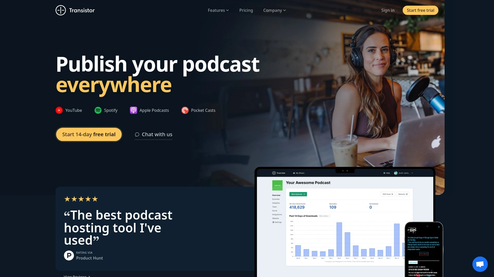

Transistor removes artificial constraints by offering unlimited podcast hosting, meaning you can create as many shows and episodes as needed without per-episode charges. Multi-user access and private podcasting make it ideal for teams and businesses using audio for internal communication or exclusive content. The platform automatically posts episodes to YouTube, expanding your reach beyond traditional podcast apps.

Dynamic ad insertion lets you update monetization strategies on existing episodes, and detailed analytics track performance across platforms. Integration with Riverside.fm provides professional recording capabilities, while AI transcription costs just $1 per hour of content. Plans start at $19/month for up to 20,000 downloads monthly, with higher tiers accommodating growing audiences.

## [Captivate](https://www.captivate.fm)

A growth-focused podcast hosting platform emphasizing audience building through marketing tools, detailed analytics, and monetization features.

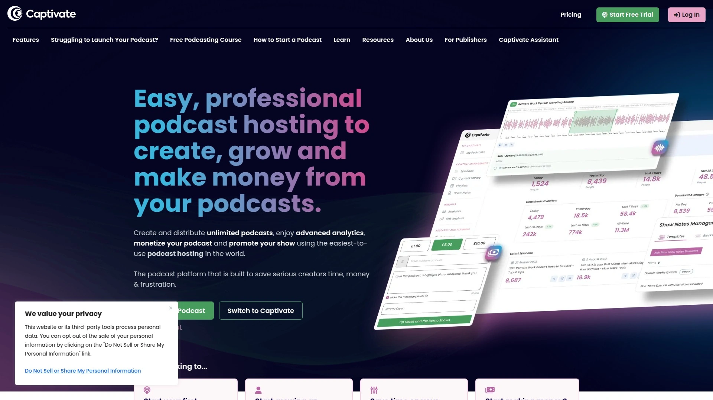

Captivate positions itself as more than just hosting, providing comprehensive analytics that reveal listener demographics, engagement patterns, and growth trends. Marketing features include customizable calls to action, automatic social sharing, and SEO-optimized podcast websites that help attract new listeners. The platform offers unlimited public podcasts, though private podcast limits vary by plan tier.

Dynamic ad insertion and sponsorship integration give you multiple monetization paths without external tools. Live customer support responds quickly to technical issues and strategic questions. Plans are tiered based on download volume, making it accessible for new shows while accommodating established podcasts.

## [Castos](https://castos.com)

A powerful podcast hosting service with WordPress integration, YouTube republishing, and automatic transcription for improved accessibility and SEO.

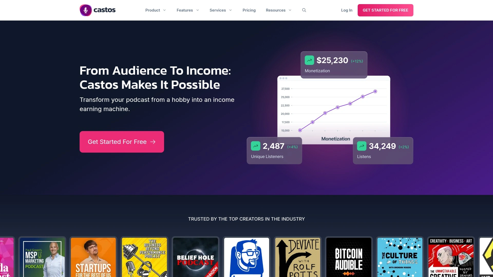

Castos excels through its Seriously Simple Podcasting WordPress plugin, letting you upload and publish episodes directly from your website backend just like adding a blog post. Advanced analytics show listener geography, discovery sources, and device types, providing actionable insights for growth strategies. Automatic YouTube republishing takes your audio content and posts it as video, tapping into YouTube's massive audience without extra work.

Automatic transcription of episodes boosts your website's SEO and makes content accessible to hearing-impaired audiences. Dynamic ad insertion and listener donations provide monetization options, while private podcasts let you offer exclusive content. All plans include unlimited storage, unlimited podcasts, and unlimited episodes, with pricing starting at $19/month and scaling based on download volumes.

## [Simplecast](https://simplecast.com)

An independent podcaster-focused platform known for straightforward publishing, robust distribution, and transparent analytics.

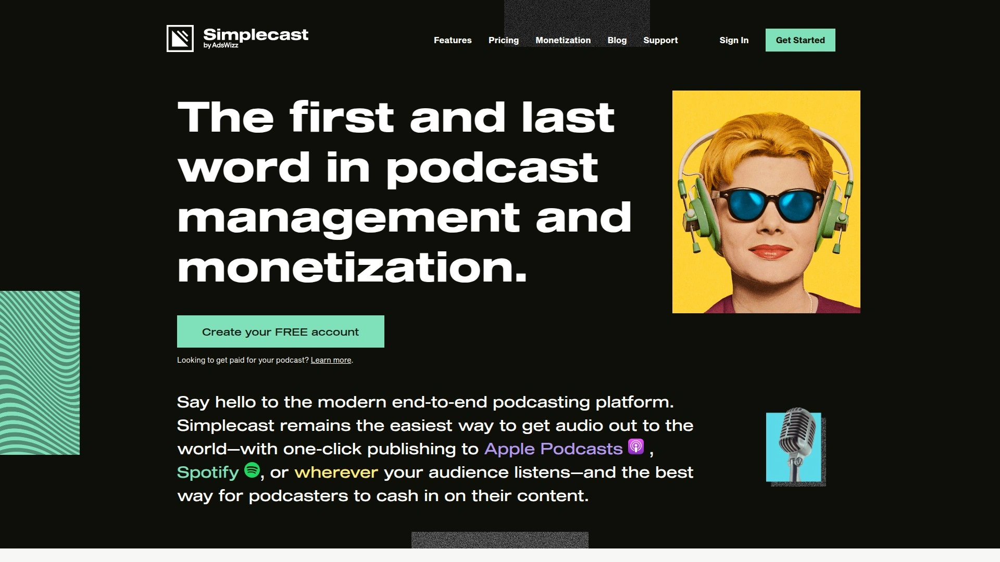

Simplecast has spent nearly seven years refining its tools for podcasters who value simplicity without sacrificing power. Publishing and distribution happen with one-click submission to Apple Podcasts, Spotify, and wherever your audience listens. Analytics provide clear insights into episode performance without overwhelming you with unnecessary metrics.

The platform supports team collaboration through sharing tools and multi-user access. Embed players integrate cleanly into websites, maintaining your brand aesthetic. Plans start at $15/month, positioning Simplecast as a mid-range option for serious creators who don't need enterprise features.

## [Blubrry](https://blubrry.com)

A WordPress-optimized podcast hosting service featuring the PowerPress plugin, certified analytics, and generous bandwidth allowances.

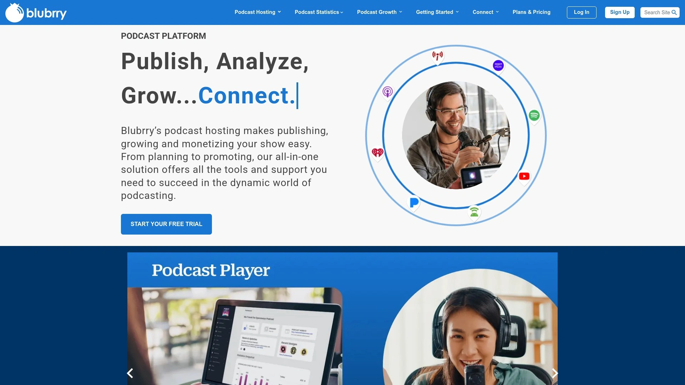

Blubrry's PowerPress plugin makes WordPress integration seamless, turning your blog into a full podcast publishing platform. The platform has operated since 2005, building deep expertise in essential podcast tools without adding unnecessary complexity. Interactive Advertising Bureau certification means your analytics meet industry standards for attracting sponsors.

All plans include unlimited bandwidth, eliminating overage fees when episodes go viral. The platform offers "no fault overage" on storage, meaning they don't penalize you for exceeding your monthly limit by less than 25%. Managed WordPress hosting plans are available for creators who want their entire web presence handled in one place. Plans range from $12/month for 100MB storage to $80/month for 1GB.

## [RedCircle](https://redcircle.com)

A monetization-first podcast hosting platform offering unlimited uploads and storage with tools specifically designed for earning revenue.

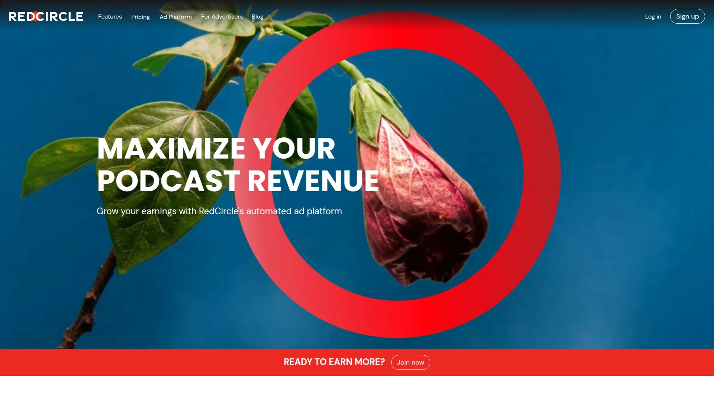

RedCircle focuses relentlessly on helping podcasters make money, providing dynamic ad insertion with control over which brands and ad categories appear in your content. One dashboard manages all your podcasts, simplifying workflow when you're juggling multiple shows. Unlimited uploads and storage at any price point remove constraints on how much content you create.

Customizable subscription and donation features let you tailor monetization to your audience's preferences. Cross-promotion tools help you grow multiple shows within your network. Plans start at $14.99/month, with tiers at $29.99/month and $99.99/month based on features needed.

## [Acast](https://www.acast.com)

A global podcast hosting platform with 40,000+ shows and a marketplace connecting creators with advertising opportunities at scale.

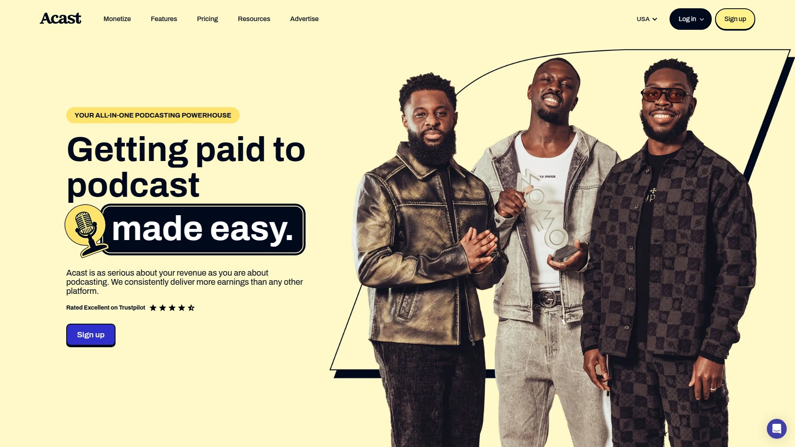

Acast operates in the intersection of hosting and monetization, running a marketplace where podcasters can connect with brands seeking ad placements. Distribution spans every major directory including Apple Podcasts, Spotify, Google Podcasts, Amazon Music, and hundreds of others. The platform serves creators across all genres with tools for both emerging and established shows.

Monetization through the Acast marketplace provides access to programmatic advertising without needing to pitch sponsors individually. Plans start at $25/month, reflecting the platform's focus on creators ready to treat podcasting as a business.

## [Ausha](https://www.ausha.co)

A European podcast hosting platform emphasizing marketing tools, social distribution, and analytics to help creators grow their audience.

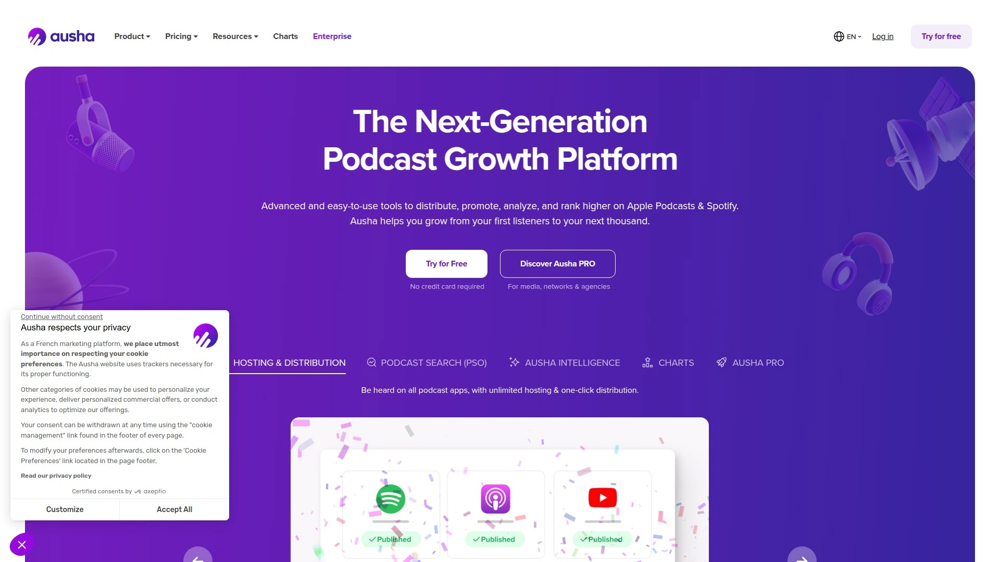

Ausha offers unlimited hosting alongside marketing features designed specifically for podcast promotion. Social sharing tools automate the process of getting episodes in front of potential listeners across multiple platforms. Distribution handles major directories while keeping the process simple.

Multiple monetization methods give you flexibility in how you earn from your content. The platform's pricing sits close to comparable services like RSS.com, making it a competitive mid-tier option. Analytics track growth trends and listener behavior to inform your content strategy.

## [Riverside](https://riverside.fm)

An all-in-one podcasting platform combining 4K video recording, studio-quality audio capture, built-in editing, and hosting with AI-powered features.

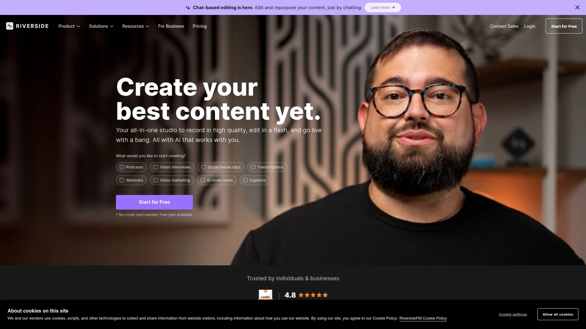

Riverside takes a different approach by handling the entire podcasting workflow in one place. Record locally in 4K video and studio-quality audio, ensuring internet hiccups don't ruin your recordings. Built-in editing tools let you cut, arrange, and polish episodes without switching to external software.

AI-powered features repurpose long-form content into social clips, audiograms, and shareable snippets that extend your reach. One-click publishing sends finished episodes to major platforms, and unlimited storage means old episodes stay accessible indefinitely. The platform integrates seamlessly with external hosts like Spotify, letting you record with Riverside and distribute elsewhere if preferred.

## [Megaphone](https://www.megaphone.fm)

An enterprise-grade podcast hosting and monetization platform built for large publishers, networks, and premium content creators.

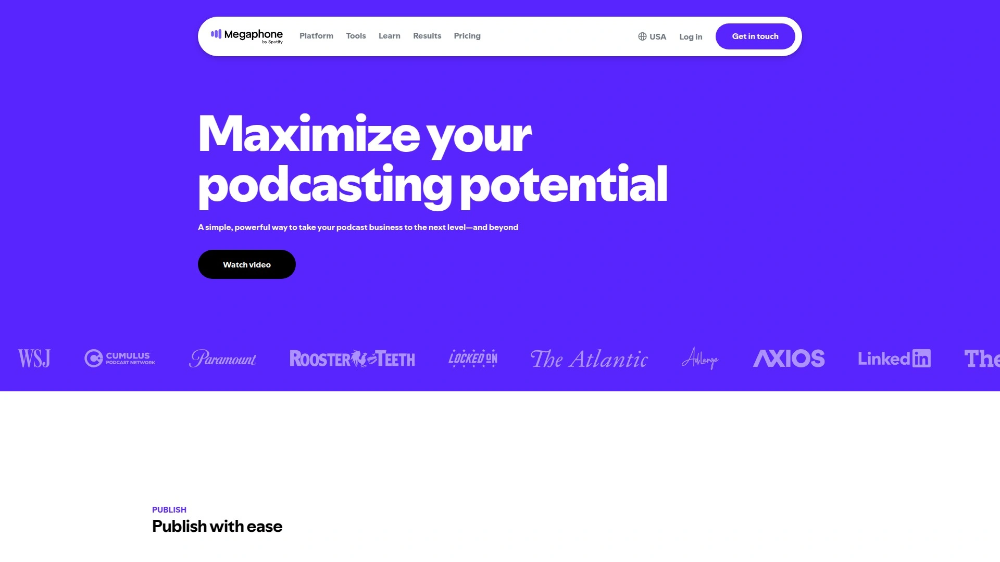

Megaphone targets professional operations needing sophisticated tools for managing multiple shows, complex ad campaigns, and detailed audience insights. Dynamic ad insertion operates at scale, letting networks monetize entire catalogs efficiently. Advanced analytics provide the granular data advertisers demand when considering sponsorships.

The platform handles high-volume distribution reliably, making it suitable for shows with millions of downloads monthly. Pricing reflects its enterprise positioning and requires direct contact for quotes.

## [Omny Studio](https://omnystudio.com)

A broadcast-focused podcast platform designed for radio stations and media companies transitioning to on-demand audio.

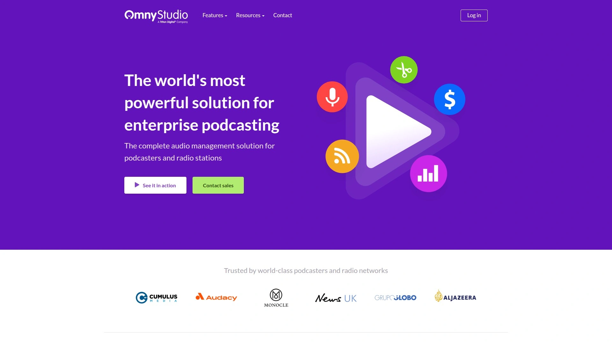

Omny Studio specializes in serving broadcasters and radio networks with tools for podcast hosting, radio capture, and audio management. Publishing and editing features are built for professional workflows where multiple team members contribute to content production. Monetization and analytics cater to the needs of established media organizations.

Secure distribution with randomized tokens, signing keys, and cryptographic hashing ensures only authorized listeners access private content. The platform targets enterprise clients, making it less suitable for individual podcasters just starting out.

## [RSS.com](https://rss.com)

An easy-to-use podcast hosting platform offering unlimited storage, simple distribution, and cross-platform analytics for creators at any level.

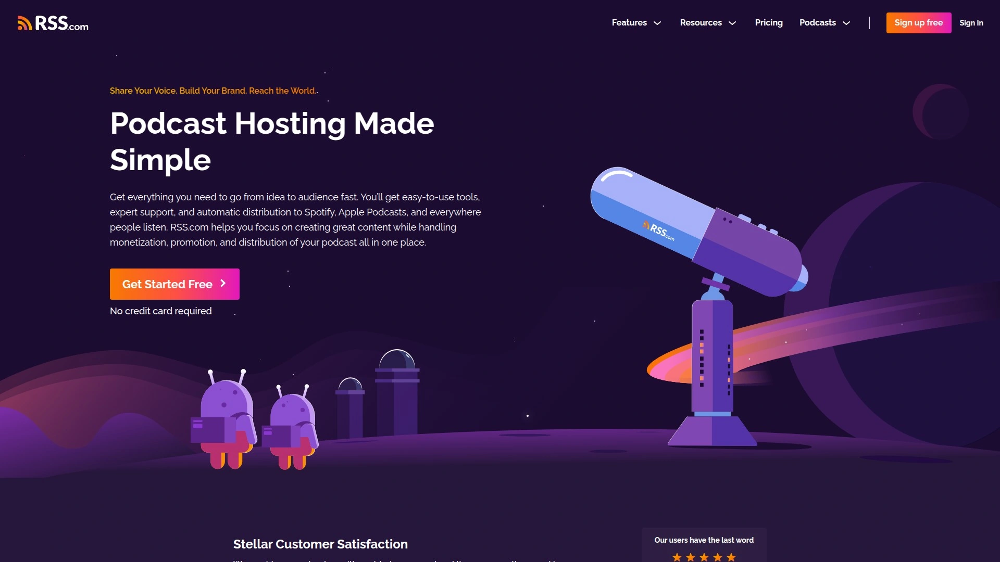

RSS.com provides unlimited hosting without artificial caps on episode numbers or file sizes. Cross-platform analytics show downloads across time periods, top episodes, follower counts, and listener locations with device and application breakdowns. Distribution to major directories happens automatically once episodes are uploaded.

Social sharing tools help promote new episodes across your networks, and various monetization methods give you options for earning. The platform caters to both beginners and experienced podcasters with an interface that doesn't require technical expertise. Pricing is competitive with similar hosts, making it accessible for most budgets.

## [Fusebox](https://fusebox.fm)

A reliable podcast hosting platform emphasizing simplicity, stability, and straightforward tools for creators who want hosting that just works.

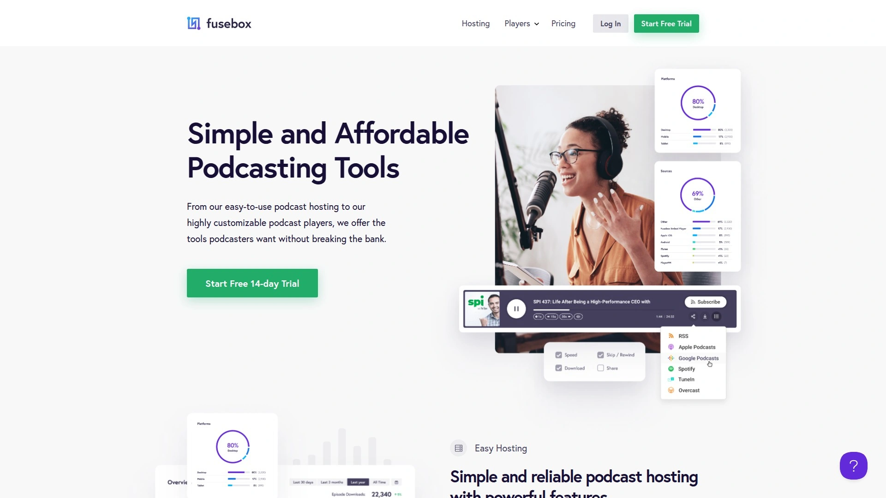

Fusebox focuses on core hosting essentials without overwhelming users with features they don't need. The platform maintains a reputation for reliability, ensuring episodes remain available and download speeds stay consistent. Basic analytics provide the key metrics you need to understand audience growth and episode performance.

Distribution covers major directories, and embed players integrate cleanly into websites. The platform positions itself as an all-rounder suitable for hobbyists through to established creators.

## [Hello Audio](https://helloaudio.fm)

A podcast hosting platform specializing in private audio feeds, letting you create exclusive communities around your content.

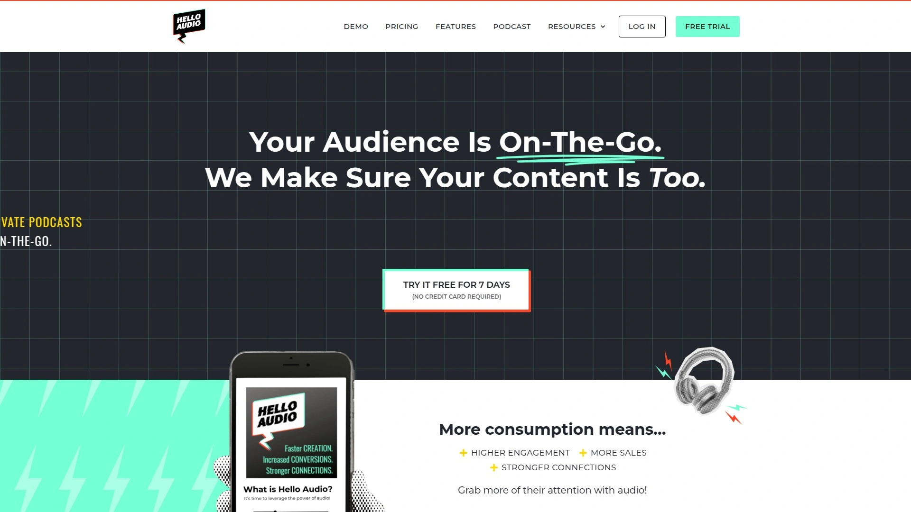

Hello Audio excels at helping creators repurpose video and audio content into private feeds accessible only to members. Distribution to major listening apps like Spotify and Apple Podcasts happens with a few clicks, while you maintain control over who can access premium content. Detailed listener data per episode shows which content resonates with your community.

The platform targets creators building membership-based podcasts or offering course content through audio. This focus on private communities distinguishes it from hosts prioritizing broad public distribution.

## [Pinecast](https://www.pinecast.com)

An affordable podcast hosting platform with unlimited everything on paid plans, plus a genuinely free tier without time limits.

Pinecast's free plan includes up to two shows with ten episodes total, basic analytics, and a tip jar, all without time restrictions or pressure to upgrade. Paid plans at $5/month unlock unlimited shows, unlimited episodes, larger file sizes, premium analytics, free transcripts, and a podcast website. Notifications alert you via email, Slack, Discord, or webhooks when events occur on your podcast.

The WordPress plugin creates posts for episodes automatically, giving you complete control over presentation and theme customization. This flexibility makes Pinecast suitable for creators who want affordable hosting without sacrificing features.

## [Spreaker](https://www.spreaker.com)

A podcast hosting and distribution platform with social features connecting creators to an active community of listeners.

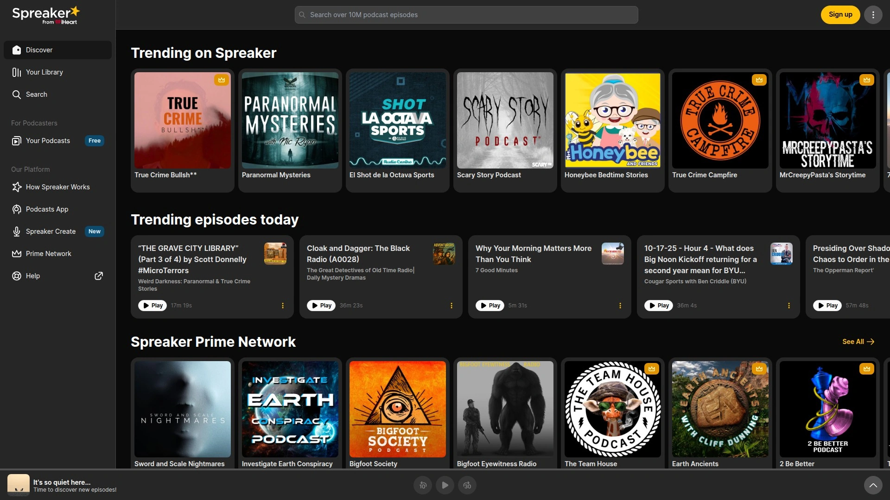

Spreaker functions as both a hosting platform and a directory where listeners discover new shows. RSS importing makes it easy to migrate from other hosts, including direct integration with SoundCloud. Distribution settings let you publish to major platforms while maintaining flexibility over where your content appears.

The platform includes tools for creator monetization and audience engagement beyond simple download numbers. Community features help smaller shows find their initial audience within Spreaker's listener base.

## [Podserve](https://www.podserve.fm)

A full-service podcast hosting platform offering unlimited storage and podcasts with 1-on-1 customer support for every user.

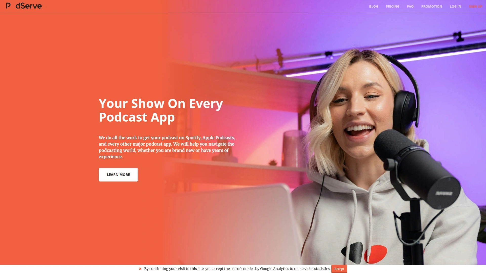

Podserve removes limits on how many podcasts you can create and how much storage you consume, making it suitable for network operators and prolific creators. One-on-one customer support ensures you can get help when technical issues arise or you need guidance on best practices. Free podcast promotion tools help new shows gain traction.

The platform positions itself as hands-on, prioritizing personal service over automated systems.

## [Podomatic](https://www.podomatic.com)

A podcast hosting company doubling as a player and directory, offering 6 hours of free storage with basic analytics.

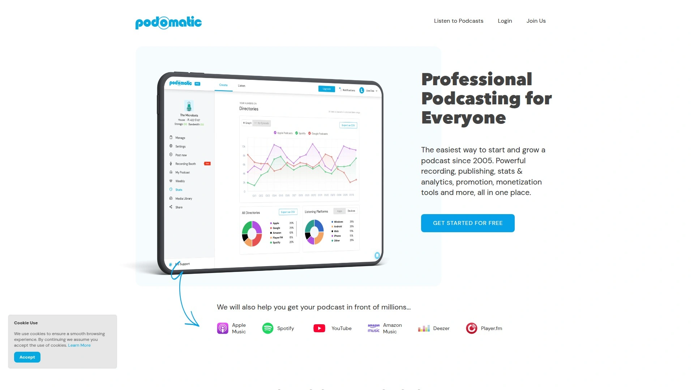

Podomatic provides free hosting for your first 6 hours of content, including analytics to track performance. The combination of player and hosting means listeners can discover and play your content within the Podomatic ecosystem. This dual function helps new podcasters find their first listeners.

Migration tools let you move existing content from other platforms if you outgrow your current host. The platform suits hobby podcasters and those testing whether consistent content creation fits their schedule.

## [Podigee](https://www.podigee.com)

A European podcast hosting platform with a powerful web player, unlimited bandwidth, and scalable delivery for sudden traffic spikes.

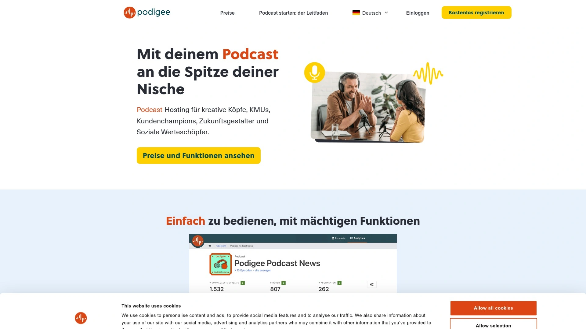

Podigee simplifies podcast hosting into three straightforward steps while maintaining powerful features under the hood. Unlimited bandwidth ensures your episodes remain available at consistent speeds whether you have 100 or 10,000 listeners. The infinitely scalable delivery network handles traffic spikes without degrading performance.

Collaborators can work together on your podcast at no additional cost, making it suitable for team-produced shows. The web player includes advanced features rarely found elsewhere, enhancing the listening experience for your audience. Plans range from $4 to $60 monthly based on features needed.

## [CoHost](https://www.cohostpodcasting.com)

A podcast hosting platform emphasizing ease of use with standard features like embeddable players, automatic websites, and social publishing.

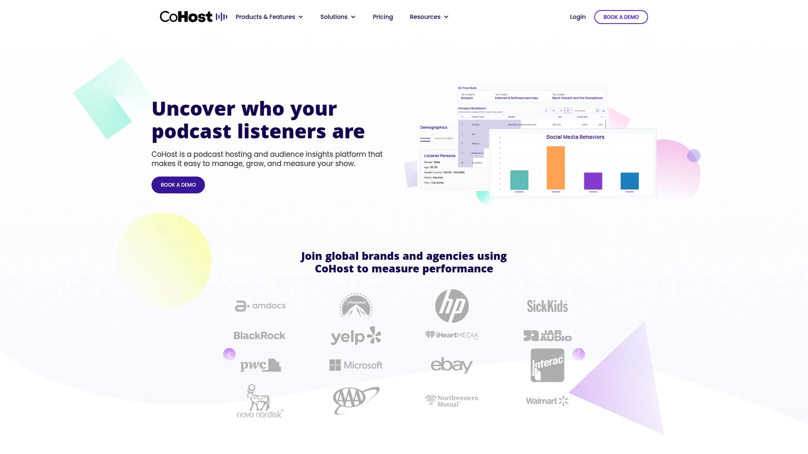

CoHost provides the core hosting essentials podcasters need, including storage, an embeddable media player, and automatic podcast website generation. Social media publishing tools help promote new episodes across platforms. Customizable RSS feeds give you control over how your content appears in directories.

Podpage integration and WordPress plugin options extend your podcast's web presence beyond the basic hosted site. Pricing at $24/month positions it as a mid-range option for creators wanting reliable hosting without enterprise complexity.

## [Fireside](https://fireside.fm)

A podcast hosting platform created by podcasters for podcasters, offering unlimited everything in a single straightforward plan.

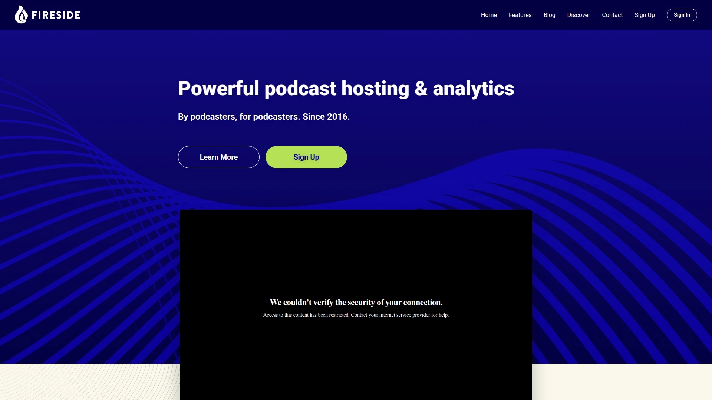

Fireside was built by Dan Benjamin of the 5by5 network, bringing deep industry knowledge to platform design. One plan at $19/month includes unlimited hosting, unlimited episodes, unlimited bandwidth, and unlimited downloads. The all-in-one approach provides hosting, a polished website, and statistics in a simple package.

Import features let you migrate existing podcasts from any platform. The platform keeps things deliberately uncomplicated, appealing to creators who value simplicity over exhaustive feature lists.

## [SoundCloud](https://soundcloud.com)

A music and audio sharing platform that also hosts podcasts, best suited for creators who want to reach SoundCloud's massive music-focused community.

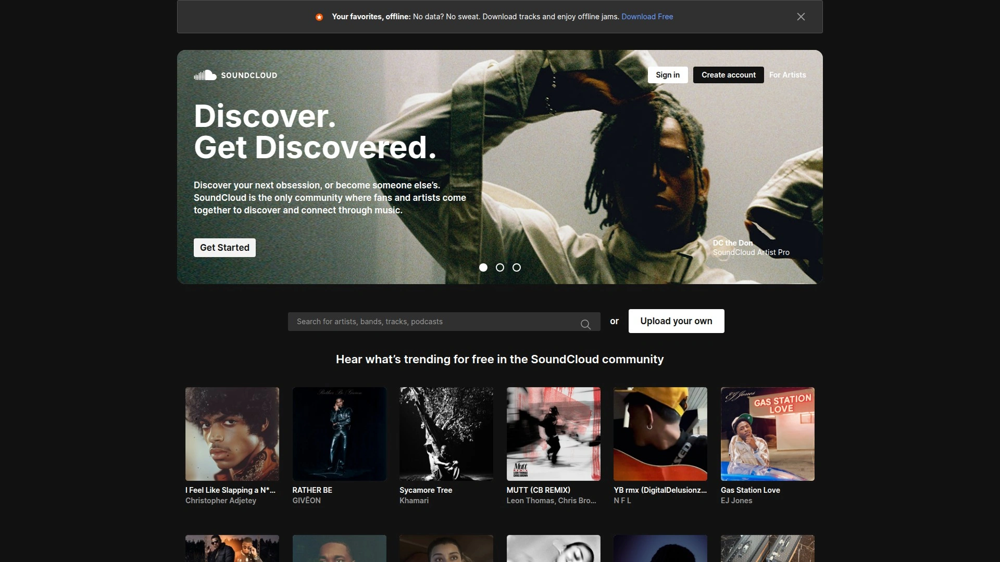

SoundCloud's 265 million tracks and enormous user base offer distribution potential beyond traditional podcast directories. The platform is easy to get started with, making it approachable for first-time creators. RSS feed forwarding lets you redirect listeners to other hosts if you decide to migrate.

The main limitation is that SoundCloud isn't specifically designed for podcasters, meaning its features and interface don't directly complement podcast workflows as well as dedicated hosts. It works well for hobby shows and creators already engaged with SoundCloud's music community.

## [Whooshkaa](https://www.whooshkaa.com)

A podcast hosting service targeting radio broadcasters and network-style podcasters with professional-grade tools.

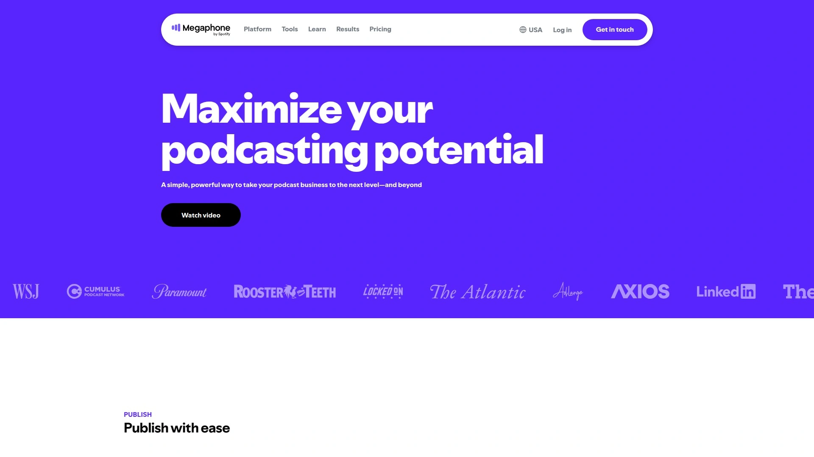

Whooshkaa specializes in serving radio stations transitioning to podcast distribution and media companies managing multiple shows. The platform doesn't advertise pricing publicly, suggesting a custom enterprise approach based on specific needs. Features cater to professional operations rather than individual hobby podcasters.

The target demographic means Whooshkaa is less suitable for beginners or solo creators just starting their podcasting journey.

## [Podcasts.com](https://www.podcasts.com)

A free podcast hosting platform and directory offering unlimited storage and bandwidth without usage caps.

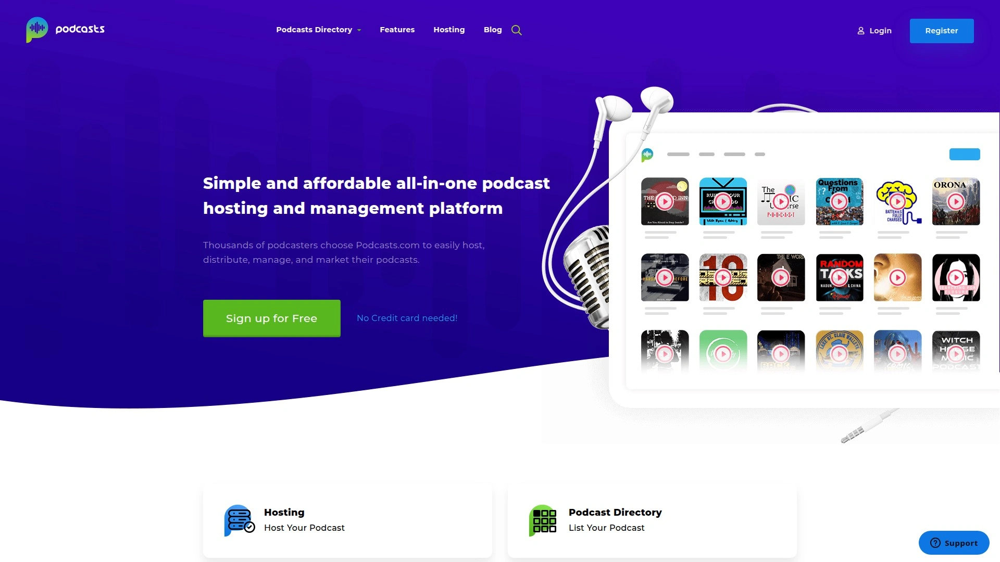

Podcasts.com removes financial barriers entirely by providing unlimited storage and bandwidth at zero cost. The combined hosting and directory approach helps new shows find listeners within the platform's ecosystem. Distribution to external directories ensures your content reaches audiences beyond Podcasts.com users.

The free model makes it particularly attractive for creators uncertain about long-term commitment or those producing content as a hobby rather than a business.

***

### How do I choose between free and paid podcast hosting?

Free hosting works if you're testing podcasting or producing occasional episodes, but paid plans unlock unlimited storage, better analytics, and monetization tools worth the investment once you're committed. Most creators should start free, then upgrade when storage limits or feature restrictions become frustrating.

### What analytics actually matter for podcasters?

Focus on total downloads, geographic location of listeners, and which episodes retain attention best. Device and app data helps optimize audio quality, while listener drop-off points show where content loses people. Ignore vanity metrics and concentrate on trends over time rather than individual episode spikes.

### Can I switch podcast hosts without losing subscribers?

Yes, through RSS feed forwarding where your old host redirects listeners to the new one automatically. Most platforms offer import tools that migrate episode data, show notes, and artwork in one process. The transition typically takes two weeks for all directories to update their references.

---

### Conclusion

Hosting shouldn't be the hard part of podcasting. The platforms above handle technical distribution so you can focus on recording conversations worth having, editing them into something listenable, and showing up consistently for your audience. For creators wanting a balance of beginner-friendly design, professional features, and reasonable pricing, [Buzzsprout](#buzzsprout) delivers comprehensive tools that scale from your first episode through to building a serious show with a dedicated following.
